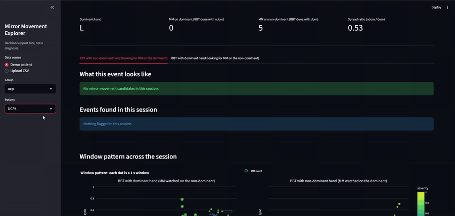

# Mirror Movement Detection



[Open the MP4 demo video](doc/demo/MM_demo.mp4)

## Overview

This repository contains a decision-support pipeline for detecting candidate Mirror Movements (MM) in bilateral wrist accelerometer recordings collected during the Box and Blocks Test (BBT).

The package analyzes one patient at a time. It does not implement a UCP-vs-TD classifier as its final output. Instead, it highlights short windows compatible with MM and attaches event-level explanations based on clinically interpretable signal features.

**The workflow is designed for technical review and clinical validation: detections are candidate events, not standalone diagnoses.**

## Features

- **Single-patient analysis:** Loads one bilateral BBT recording and processes `dom-active` and `ndom-active` sessions separately.
- **Schema validation:** Checks that uploaded or local CSV files match the expected accelerometer schema.
- **Signal preprocessing:** Computes ENMO, zero-phase Y/Z Butterworth bandpass filtering, jerk magnitude, and sliding windows.
- **Artifact exclusion:** Removes gross movements using iterative robust thresholds over 0.5 s, 1 s, and 2 s scales.
- **Interpretable features:** Uses asymmetry, bilateral synchrony, jerk correlation, ENMO peak, and jerk RMS.
- **Intra-patient detectors:** Fits robust quantile, Isolation Forest, and PCA reconstruction detectors on each patient's calm windows.
- **Median ensemble:** Combines detector scores with a conservative median aggregation.
- **Composite MM rule:** Applies explicit score, asymmetry, synchrony, artifact, and boundary criteria.
- **Patient-level geometry:** Reports a dispersion ratio on the `(asymmetry_index, xcorr_max)` plane as secondary evidence.
- **Streamlit webapp:** Provides demo-patient loading, one-patient CSV upload, event inspection, signal zooms, and scatter plots.
- **Reproducible EDA scripts:** Regenerates sprint figures, ablations, CSV summaries, and the final project report.

## Tech Stack

- **Python**
- **NumPy**
- **Pandas**
- **SciPy**
- **scikit-learn**
- **Matplotlib**
- **Plotly**
- **Streamlit**

## Sources and Data

The anonymized dataset is included in `data/`. By default, `config.py` resolves data paths relative to the repository root:

```text
data/UpdatedData/ucp/bbt_ucp_raw_anon.csv
data/UpdatedData/td/bbt_td_raw_anon.csv
```

The expected raw CSV schema is:

```text
Accelerometer X
Accelerometer Y
Accelerometer Z
datetime
hand
hand_dominance
type
hand_type
session
hand_label
id
```

Expected categorical values:

| Column           | Values        | Meaning                                |
| ---------------- | ------------- | -------------------------------------- |
| `type`           | `ucp`, `td`   | Cohort label in the source dataset     |
| `hand_type`      | `dom`, `ndom` | Dominant or non-dominant hand identity |
| `session`        | `dom`, `ndom` | Hand active during the BBT session     |
| `hand`           | `L`, `R`      | Anatomical hand                        |
| `hand_dominance` | `L`, `R`      | Patient dominant hand                  |

For webapp uploads, the CSV must contain exactly one patient id. Both `dom` and `ndom` sessions are recommended; at least one valid bilateral session is required.

## Method

The final pipeline follows this sequence:

1. Load a bilateral BBT recording for one patient.
2. Split the recording into `dom-active` and `ndom-active` sessions.
3. Compute per-hand ENMO:

```text
ENMO(t) = max(sqrt(ax^2 + ay^2 + az^2) - 1, 0)
```

4. Apply a zero-phase fourth-order Butterworth bandpass on Y/Z axes over 0.5-15 Hz.
5. Compute jerk magnitude from the bandpassed Y/Z signals.
6. Build 1 s windows with 50% overlap.
7. Detect gross motor artifacts with iterative `median + 7*MAD` thresholds at 0.5 s, 1 s, and 2 s scales.
8. Extract the selected feature vector:

```text
asymmetry_index
xcorr_max
bilateral_jerk_corr
enmo_peak
jerk_mag_rms
```

9. Fit three detectors on the patient's calm windows:

```text
robust quantile detector
Isolation Forest
PCA reconstruction detector
```

10. Combine detector scores with the median ensemble.
11. Apply the final MM-candidate rule.
12. Compute the patient-level dispersion ratio as a secondary indicator.

## Final MM-Candidate Rule

A window is marked as `is_mm_candidate` when:

```text
score_median >= 0.70
AND asymmetry_index <= 0.60
AND xcorr_max >= 0.40
AND not is_artifact
AND not is_boundary
```

Where:

| Field             | Description                                                                               |
| ----------------- | ----------------------------------------------------------------------------------------- |
| `score_median`    | Median score from the robust quantile, Isolation Forest, and PCA reconstruction detectors |
| `asymmetry_index` | Signed energy asymmetry between active and still hand                                     |
| `xcorr_max`       | Maximum bilateral cross-correlation within the configured lag range                       |
| `is_artifact`     | Gross movement flag used as an exclusion mask                                             |
| `is_boundary`     | First and last 3 seconds of each session, excluded because of noise.                      |

## Patient-Level Dispersion Indicator

The package computes a geometric dispersion ratio on the `(asymmetry_index, xcorr_max)` plane:

```text
dispersion_ratio = dispersion_ndom / dispersion_dom
```

This value is displayed in the webapp as secondary patient-level evidence. It is not a hard filter in the window-level MM rule.

## Getting Started
### Installation

Create and activate a virtual environment from the repository root:

```bash
python -m venv .venv
```

Windows PowerShell:

```powershell
.\.venv\Scripts\Activate.ps1
```

macOS/Linux:

```bash
source .venv/bin/activate
```

Install the minimal runtime dependencies:

```bash
pip install -r requirements.txt
```

## Usage

### Running the Webapp

Start Streamlit from the repository root:

```bash
streamlit run webapp/app.py
```

The app supports:

- Selecting demo patients from the local anonymized dataset.
- Uploading a one-patient CSV.
- Viewing MM-candidate counts by session.
- Inspecting event-level explanations.
- Viewing a 2 s signal zoom around a selected event.
- Comparing session scatter plots on the `(asymmetry_index, xcorr_max)` plane.

An upload-ready test file is available at:

```text
data/upload_examples/ucp5_webapp_upload.csv
```

Expected output for UCP5:

```text
dom  -> 0 MM candidates
ndom -> 13 MM candidates
dispersion_ratio -> about 1.78
```

### Reproducing Sprint Outputs

Run the sprint scripts from the repository root:

```bash
python -m eda.explore
python -m eda.preprocess_demo
python -m eda.artifact_demo
python -m eda.feature_demo
python -m eda.detector_demo
python -m eda.mm_rule_ablation
python -m eda.scatter_dispersion_demo
```

Outputs are written under this folder:

```text
doc/figures/
```

## Project Structure

| Path             | Purpose                                                                                          |
| ---------------- | ------------------------------------------------------------------------------------------------ |
| `config.py`      | Central configuration for paths, sampling rate, thresholds, feature sets, and plotting constants |
| `data_io/`       | CSV schema validation and patient/session loading                                                |
| `preprocessing/` | ENMO, Y/Z bandpass filtering, jerk, axis handling, and windowing                                 |
| `artifact/`      | Robust intra-patient artifact detection                                                          |
| `features/`      | Per-window features and patient-level scatter dispersion                                         |
| `detectors/`     | Robust quantile, Isolation Forest, PCA reconstruction, median ensemble, and MM rule              |
| `explain/`       | Feature glossary and event-level clinical explanations                                           |
| `eda/`           | Reproducible scripts for figures, ablations, and CSV summaries                                   |
| `webapp/`        | Streamlit WebApp                                                                                 |
| `doc/`           | Sprint documentation, figures, CSV outputs, and final report                                     |

## Documentation and Outputs

- [Final Report](doc/final_report.md)
- [Sprint 0: Setup and Exploratory Data Analysis](doc/sprint_00_setup_eda.md)
- [Sprint 1: Preprocessing](doc/sprint_01_preprocessing.md)
- [Sprint 2: Artifact Baseline](doc/sprint_02_artifact_baseline.md)
- [Sprint 3: Feature Engineering](doc/sprint_03_features.md)
- [Sprint 4: Detector Design](doc/sprint_04_detectors.md)
- [Sprint 5: Rule Ablation](doc/sprint_05_ablation.md)
- [Sprint 5b: Scatter Dispersion](doc/sprint_05b_scatter_dispersion.md)
- [Sprint 6: Web App](doc/sprint_06_webapp.md)
- [MM Candidate Summary](doc/figures/sprint_04/summary_mm.csv)
- [Rule Ablation Grid Results](doc/figures/sprint_05/ablation/grid_results.csv)
- [Scatter Dispersion Values](doc/figures/sprint_05/scatter_dispersion.csv)

## Other Experiments

The full research workspace also contained earlier experiments outside this release. They are not part of this GitHub branch, but they document the research path that led to the current design.

| Area                      | Description                                                                                                                 |
| ------------------------- | --------------------------------------------------------------------------------------------------------------------------- |
| Classical ML              | Supervised UCP-vs-TD experiments on engineered features, including selected-feature variants and raw/preprocessed pipelines |
| Split generation          | Patient-level K-fold and leave-one-out split generation used to avoid subject leakage                                       |
| 1D deep learning          | ENMO-based CNN experiments: shared-weight two-branch CNN, independent-branch CNN, and CNN-LSTM cascade                      |
| Spectrogram deep learning | STFT and EfficientNet experiments using dual-branch, signed-delta, and RGB-like spectrogram inputs                          |


## Issues and Known Constraints

- The final rule is calibrated on the available anonymized cohort and should be revalidated before use on a different acquisition protocol.
- The first and last 3 seconds of each session are excluded from MM-candidate decisions because of setup noise.
- A 60s BBT recording may not contain visible MM events for every UCP patient.
- TD sessions can contain gross movement artifacts, so the pipeline uses intra-patient baselines instead of a TD-trained anomaly baseline.

## License, Citation, and Issue Reporting

This project uses a dual-license structure:

- **Code:** licensed under the [Apache License 2.0](LICENSE).
- **Documentation, reports, figures, and plots:** licensed under [Creative Commons Attribution 4.0 International](LICENSE-DOCS).

Included anonymized data files are provided to support reproducibility of this project. Do not attempt to re-identify individuals, and preserve attribution to the original repository and authors when using derived results.

When using, modifying, redistributing, or building upon this project, preserve the attribution notice in [NOTICE](NOTICE). Academic and derivative use should cite the repository using [CITATION.cff](CITATION.cff).

Issues, bugs, documentation problems, and reproducibility questions should be reported through GitHub Issues. A useful report should include a short description, the steps needed to reproduce the problem, the expected and observed behavior, the Python version, the operating system, and any relevant traceback or screenshot. Do not include sensitive or non-anonymized clinical data in public issues.
