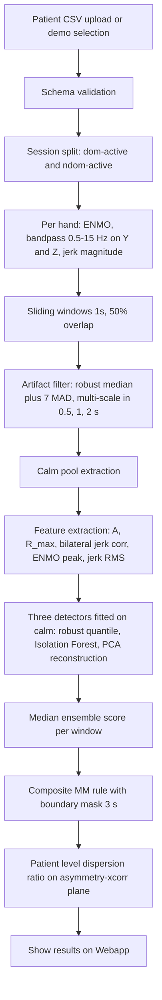

# Explainable Mirror Movement Detection

## 1. New task

The original aim of classifying patients with Unilateral Cerebral Palsy (UCP) versus typically developing (TD) controls was revoked. The clinicians required a decision-support tool that, given a 60 s bilateral wrist accelerometric recording of the Box and Blocks Test (BBT), highlights on the timeline the windows compatible with Mirror Movements (MM) of the contralateral, task-free hand, providing per-event explanations grounded in clinically meaningful quantities.

## 2. Methods

**Acquisition:** Triaxial accelerometer, fs = 80 Hz, two BBT sessions per patient (`dom-active` and `ndom-active`, exercise performed with each hand in turn). The hand observed for MM is the one expected to be still in the given session.

**Gravity removal:** Raw RMS was indistinguishable between UCP and TD because the static gravity vector dominates the signal. We adopt the Euclidean Norm Minus One:

$$\text{ENMO}(t) = \max\bigl(\sqrt{a_x(t)^2 + a_y(t)^2 + a_z(t)^2} - 1,\ 0\bigr)$$

Clipped at zero (standard formulation), rotation-invariant, scalar. Used for amplitude features.

**Directional bandpass on Y, Z:** The X axis carries sensor-mount artefacts (clinical hint, confirmed visually). Y and Z are filtered with a zero-phase Butterworth bandpass of order 4 via `scipy.signal.sosfiltfilt` over [0.5, 15] Hz. Zero phase is mandatory because downstream we measure inter-hand lag with millisecond precision. The transfer function is

$$|H(j\omega)|^2 = \frac{1}{1 + \bigl(\omega/\omega_c\bigr)^{2n}}, \qquad n = 4.$$

**Jerk magnitude:** Central differences via `np.gradient` give same-length series:

$$j(t) = \frac{d\mathbf{a}(t)}{dt}, \qquad \lVert j(t)\rVert = \sqrt{j_y^2 + j_z^2}.$$

Captures onset rapidity.

**Sliding windows:** Window length 1s, overlap 50%. `win_len` = 80 samples, stride 40. The 50% overlap is the sweet spot between MAD (Median Absolute Deviation) independence (statistical reliability) and time resolution: at 25 percent overlap MAD on 60 windows oscillates on borderline patients, at 75 percent overlap autocorrelation inflates the spread estimate.

**Robust statistics:** All thresholds use median and scaled MAD,

$$\text{MAD}(x) = 1.4826 \cdot \text{median}\bigl(|x_i - \text{median}(x)|\bigr),$$

with a robust z-score $z_i = (x_i - \text{median}) / \text{MAD}$. Breakdown point 50 percent; required because each session contains spontaneous gross motor artefacts (arm raises, repositioning) that would poison classical moments.

**Artifact filter:** Four indicators per window (ENMO peak, peak jerk, RMS of YZ-bandpassed signal, energy ratio still over active). For each indicator we run an iterative one-sided robust threshold: a naive `median + k·MAD` on all values would be biased upward by the outliers themselves (the very thing we want to detect inflates the location estimator), so we re-estimate the threshold on shrinking subsets. Let $\text{mask}_i$ be the boolean mask of "candidate outliers" after iteration $i$, with $\text{mask}_0 = \emptyset$. We iterate

$$\text{thr}_{i+1} = \text{median}(x \mid \neg\text{mask}_i) + k \cdot \text{MAD}(x \mid \neg\text{mask}_i),\quad
\text{mask}_{i+1} = \{j : x_j > \text{thr}_{i+1}\},$$

with $k = 7$ and $\text{max iter} = 5$, stopping as soon as $\text{mask}_{i+1} = \text{mask}_i$. At each step the location and scale are re-estimated on a progressively cleaner subset, so the threshold tightens and the algorithm catches the subtler outliers it could not see on the first pass.

A window is tagged `is_artifact = True` if it falls above threshold on **any** of the four indicators at **any** of three scales (0.5, 1, 2 s), via logical OR. 
Clinically the flag does not mean "instrumental noise": it means "the still hand performed a gross movement that is not compatible with a mirror movement" (arm raise, repositioning, isolated involuntary gesture). The flag is used downstream as an **excluding mask**: a window can only become `is_mm_candidate` if `is_artifact = False`.

Choice of $k = 7$: selected by ablation on $k \in \{3, 4, 5, 7, 8, 9, 10\}$ against two criteria, *coverage* (calm pool $\ge 70\%$ on $\ge 95\%$ of triplets) and *UCP4 spike preservation* (jerk threshold $< 100$ g/s). $k = 7$ is the largest value satisfying both with a clean trade-off: lower $k$ rejects too aggressively and depletes the calm pool needed to fit the detectors, higher $k$ lets moderate artefacts (jerk $25{-}40$ g/s, arm twitches, table contacts) leak into the calm pool and contaminate the intra-patient baseline.

**Bilateral mirror score:** three per-window quantities measure the relationship between the active and the still hand. They are the actual signature exploited by the composite MM rule.

*R_max, how similar the two hands move.* We compare active and still signals (z-scored band-passed ENMO) sliding one against the other within $\tau \in [-200, +200]$ ms (a MM is not instantaneous, the still hand can lag slightly), and keep the largest absolute correlation across lags:

$$R_{\max} = \max_{|\tau| \le \tau_{\max}} \left| \frac{1}{N} \sum_i \tilde{a}(i+\tau)\, \tilde{s}(i) \right|.$$

$R_{\max} \approx 1$ means the two traces have essentially the same shape (mirror signature); $R_{\max} \approx 0$ means independent motion.

*A, which hand is doing the work.* Signed asymmetry of energy between active and still:

$$A = \frac{\text{RMS}_{\text{active}} - \text{RMS}_{\text{still}}}{\text{RMS}_{\text{active}} + \text{RMS}_{\text{still}} + \varepsilon}.$$

$A \approx +1$ only the active hand moves (normal stillness); $A \to 0$ both hands carry comparable energy (still hand is following the active one, mirror signature); $A < 0$ the "still" hand moves more than the active one (gross artefact). $A$ was the single strongest discriminator in the cohort (Mann-Whitney U, $p = 5 \times 10^{-4}$).

**Bilateral jerk correlation, are the motion onsets aligned?** 
Pearson correlation between the jerk magnitudes of the two hands. Unlike $R_{\max}$ which compares full waveforms, this one looks only at the moments of sudden change: high values mean the two hands accelerate at the same instants (compatible with MM), low values mean independent twitches.

**Three intra-patient detectors:** 
Each detector is fitted on the calm pool of the patient itself (windows with `is_artifact = False`), using the 5-dimensional feature vector $\{A,\ R_{\max},\ \text{bilateral jerk corr},\ \text{ENMO peak},\ \text{jerk RMS}\}$.

1. *Robust quantile*: per feature $z_i$ (robust z-score on the calm pool), score $s_q = 1 - \exp(-\max_i |z_i|/k_q)$ with $k_q = 5$ (saturation parameter, distinct from the artifact-filter $k$). The score saturates near $1$ when at least one feature is many MADs away from the patient baseline.
2. *Isolation Forest* (200 trees, max samples 256, sklearn implementation): raw score $-\text{decision\_function}(x)$ is mapped to $[0,1]$ via the empirical CDF of the calm-pool raw scores.
3. *PCA reconstruction* on robust-standardised features, $n_{\text{comp}} = \min(8, d) = 5$ for the selected feature set: score $\lVert x - \hat{x}\rVert^2$, again normalised by the calm-pool CDF.

Median ensemble $s_{\text{med}} = \text{median}(s_q, s_{\text{iF}}, s_{\text{PCA}})$, conservative against single-detector outliers: a window must be flagged by at least two out of three to score high.

**Composite MM rule:** A window is `is_mm_candidate` iff

$$s_{\text{med}} \ge 0.70 \ \wedge\ A \le 0.60 \ \wedge\ R_{\max} \ge 0.40 \ \wedge\ \neg\text{is\_artifact} \ \wedge\ \neg\text{is\_boundary}.$$

`is_boundary` is a boolean mask that flags windows located in the first or last 3 seconds of each session. These windows are excluded from the `is_mm_candidate` decision because they may contain non-physiological transients caused by hand placement/removal and filter edge effects.
The final cutoffs were selected by testing multiple threshold combinations and choosing the one that best separated UCP sessions from TD sessions. The selected rule reached 82.4% sensitivity for UCP detection and 89.3% specificity for TD rejection, corresponding to a Youden index of 0.716.

**Patient-level geometric metric:** Mean pairwise distance of valid points on the $(A, R_{\max})$ plane. Then we measure how much these points are scattered from each other:

$$D_S = \binom{|S|}{2}^{-1}\!\sum_{i<j} \lVert p_i - p_j\rVert_2, \qquad \rho = D_{\text{ndom}} / D_{\text{dom}}.$$

UCP show $\rho > 1$ more dispersed on the inverted-task session, TD $\rho \approx 1$ the geometry of the points remains similar between the two sessions.
The Mann-Whitney test with p = 0.0099 indicates that this difference between UCP and TD is statistically significant.

## 3. Pipeline diagram

The whole chain runs in under 10s per patient on a laptop.

## 4. Evidences accumulated along the project

* **Gravity dominates the raw signal:** Sprint 0 showed that raw RMS is almost identical in UCP and TD (0.58 g, ratio 1.02). ENMO is therefore required to remove gravity and reveal meaningful movement differences.

* **TD are not a clean baseline:** About 20% of TD sessions contain gross artefacts. This makes cross-patient TD-trained detectors unreliable and justifies the intra-patient detector design.

* **Outlier count does not discriminate:** Both groups had the same median percentage of outlier windows (5.04%). Temporal descriptors such as entropy did not separate UCP from TD (all $p > 0.16$).

* **Asymmetry is the main discriminator:** Asymmetry $A$ separates UCP from TD on both outlier and calm windows, while cross-correlation alone does not. MM candidates require low asymmetry plus high bilateral synchrony.

* **Spectral features were not informative:** Dominant frequency, band powers, and spectral entropy did not discriminate between groups ($p > 0.5$).

* **Boundary windows are unreliable:** The first and last 3 seconds contain BBT setup/cleanup transients and filter edge effects so the usable length of the provided time series is equal to 54s.

* **Not every UCP shows MM in 60 seconds:** UCP14 and UCP9 had zero MM candidates, and UCP16 was dominated by gross artefacts.
With this approach it was discovered how delicate time series are and that recordings of only 60s are sufficient but not exhaustive to show MM in patients.

* **Geometric dispersion adds patient-level evidence:** UCP9 had no MM candidates but showed high dispersion ratio ($\rho = 1.88$). This suggests that dispersion can capture mild or non-windowed manifestations missed by the current rule.

* **TD26 and TD27 are atypical TD cases:** TD27 showed high dispersion ($\rho = 1.37$), while TD26 showed opposite-side dispersion ($\rho = 0.71$). Both are flagged as atypical patients.

* **Final operating point:** The composite MM rule plus dispersion ratio achieved 82.4% sensitivity, 89.3% specificity. 
  
  
  **The tool remains decision support, requiring clinical review by the physician.**